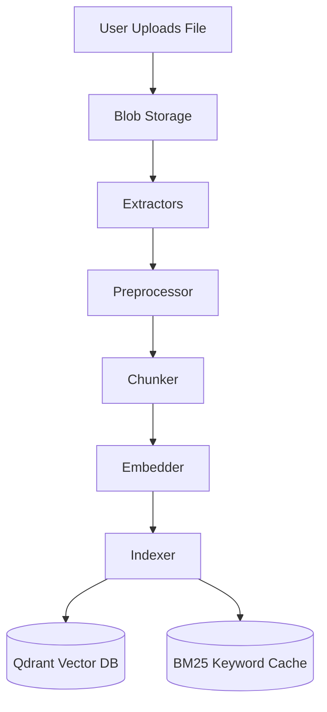
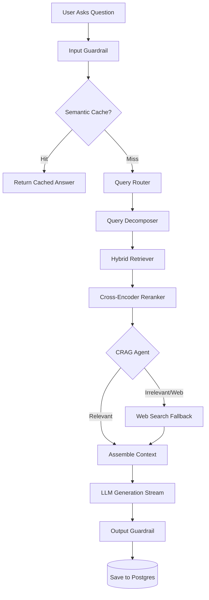

# The Complete RAG Workflow

This document explains exactly how data flows through your Retrieval-Augmented Generation (RAG) application. The system is divided into two distinct workflows: **Document Ingestion** (how data gets in) and **Query Execution** (how questions get answered).

---

## Part 1: The Ingestion Pipeline (Data In)

Before the AI can answer questions about your documents, the documents must be processed, broken down, and stored mathematically.

### Step-by-Step Breakdown:
1. **Blob Storage (`services/blob_storage.py`):** The raw file (PDF, CSV, DOCX) is immediately saved to the local hard drive inside the `data/blobs/` folder.
2. **Extractors (`pipeline/extractors/`):** The system detects the file type and uses a specialized parser to rip the raw text out of the document (e.g., PyMuPDF for PDFs).
3. **Preprocessor (`pipeline/preprocessor.py`):** The raw text is "cleaned". Special characters, weird formatting, and excessive white spaces are normalized.
4. **Chunker (`pipeline/chunker.py`):** The AI can't read a 500-page book all at once. The chunker slices the document into small, overlapping paragraphs (e.g., 800 tokens each). The overlap ensures we don't cut a sentence in half and lose context.
5. **Embedder (`pipeline/embedder.py`):** The most computationally heavy step. Each chunk is sent to an embedding model (like HuggingFace `BAAI/bge-m3`). The model converts the text chunk into a massive array of numbers (a high-dimensional vector) representing its semantic meaning.
6. **Indexer (`pipeline/indexer.py`):** The vectors are pushed to **Qdrant** (for semantic search), and the exact keywords are pushed to a **BM25 Index** (for exact-match keyword search).

---

## Part 2: The Query Pipeline (Answers Out)

When you ask a question in the chat interface, the system executes one of the most advanced, multi-step agentic workflows available today.

### Step-by-Step Breakdown:
1. **Input Guard (`security/input_guard.py`):** The system first scans your question to ensure it doesn't contain malicious prompt injections or jailbreak attempts.
2. **Semantic Cache (`services/semantic_cache.py`):** It checks Redis. If another user (or you) asked this exact same question recently, it instantly returns the previous answer, skipping the AI entirely to save time and money.
3. **Query Router (`services/query_router.py`):** The system analyzes the intent of your question. Is it a greeting? A code question? A request for live news? It tags the query so downstream systems know how to handle it.
4. **Query Decomposer (`services/query_decomposer.py`):** If you ask a complex question like *"Compare the vacation policy and the remote work policy"*, it breaks this into two separate backend searches: *"What is the vacation policy?"* and *"What is the remote work policy?"*.
5. **Hybrid Retriever (`retrieval/hybrid_retriever.py`):** It searches your documents using two different methods simultaneously:
   - **Dense Search (Qdrant):** Looks for chunks that *mean* the same thing as your question.
   - **Sparse Search (BM25):** Looks for chunks that contain the *exact keywords* in your question.
6. **Reranker (`retrieval/reranker.py`):** The Retriever usually pulls ~20 chunks. The Reranker uses a powerful Cross-Encoder ML model to deeply analyze and meticulously re-order them, ensuring the absolute best 5 chunks are at the very top.
7. **CRAG Agent (`agents/crag.py`):** The Corrective-RAG agent acts as a supervisor. It reads the top 5 chunks and grades them. If it realizes none of the chunks actually answer your question, it will autonomously rewrite your query and search the Internet (via Serper) to find the answer instead!
8. **Generation (`routes/query.py` & `rag_pipeline.py`):** The final, curated text chunks are formatted into a massive prompt and sent to Groq (Llama-3).
9. **Streaming & Persistence:** As the LLM types out the answer, it streams the words back to your browser in real-time. Once the stream finishes, it saves the final conversation to the PostgreSQL database so you can view it later.
